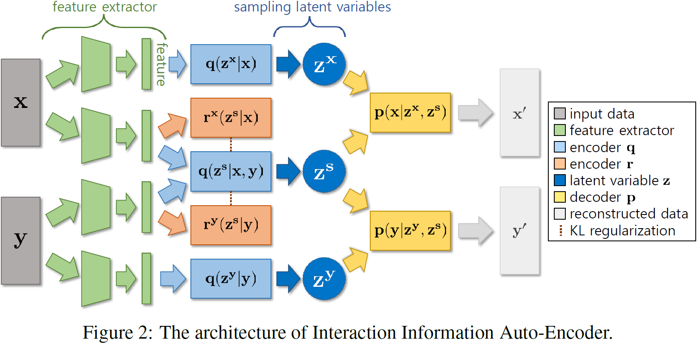
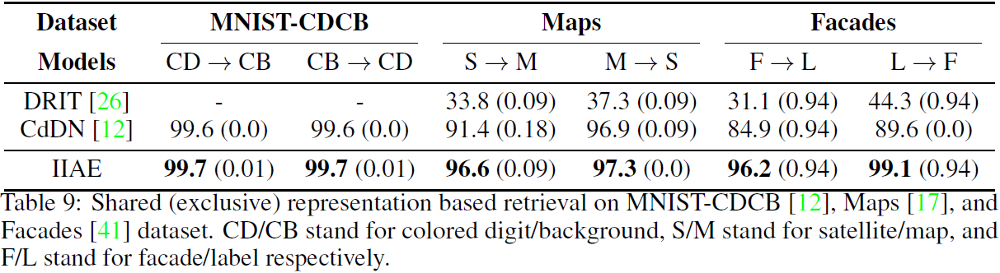
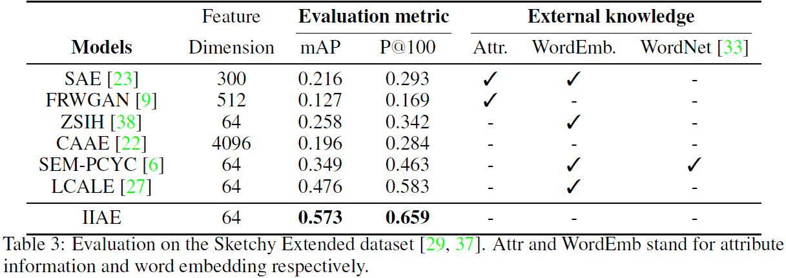

# Variational Interaction Information Maximization for Cross-domain Disentanglement




#### 1. Resolve dependencies

We recommend to use conda environment. Please run

```sh
conda env create --file IIAE.yml
```

#### 2. Prepare datasets and pre-trained models

Download [MNIST-CDCB](https://github.com/agonzgarc/cross-domain-disen), [Facades](https://github.com/phillipi/pix2pix), and [Maps](https://github.com/phillipi/pix2pix) datasets.

Download **Sketchy Extended** dataset by following [SEM-PCYC](https://github.com/AnjanDutta/sem-pcyc).

Lastly, download **Cars** dataset and  **VGG features** of Skethcy Extended dataset from this [link](http://doi.org/10.5281/zenodo.3890097).

Note that we extracted VGG features from the pretrained model provided by [SEM-PCYC](https://github.com/AnjanDutta/sem-pcyc).

Once you download all those datasets, please make sure you locate them under <root_path>/dataset/.

EX) <root_path>/dataset/MNIST-CDCB

​      <root_path>/dataset/cars

​      <root_path>/dataset/Sketchy

​      <root_path>/dataset/SketchyVGG

Now you are ready to train Interaction Information AutoEncoders (IIAEs).

You can also find the pretrained  IIAEs for those five different datasets from this [link](http://doi.org/10.5281/zenodo.3890097).

#### 3. Train and evaluate IIAE on Sketchy dataset

Train IIAE with Skethcy dataset.

```sh
python zs_cross_vae.py --mode train --root_path <root_path> --output_dir <root_path>/SUBMISSION/Sketchy
```

Evaluate IIAE with Skethcy dataset.

```sh
python zs_cross_vae.py --mode test --root_path <root_path> --output_dir <root_path>/SUBMISSION/Sketchy
```

#### 4. Train and evaluate IIAE on MNIST-CDCB, Cars, Facades, and Maps

Train IIAE with any of MNIST-CDCB, Cars, Facades, or Maps.

```sh
python run_cross_vae.py --mode train --dataset_name <dataset_name> --root_path <root_path> --output_dir <root_path>/SUBMISSION/<dataset_name>
```

Extract features and evaluate cross-domain retrieval (for MNIST-CDCB, Facades, and Maps).

```sh
python run_cross_vae.py --mode features --dataset_name <dataset_name> --root_path <root_path> --output_dir <root_path>/SUBMISSION/<dataset_name>
python feat_dist_full.py --dataset_name <dataset_name> --root_path <root_path> --output_dir <root_path>/SUBMISSION/<dataset_name>
```

Generate samples of cross-domain image translation. (for MNIST-CDCB and Cars)

```sh
python run_cross_vae.py --mode test --dataset_name <dataset_name> --root_path <root_path> --output_dir <root_path>/SUBMISSION/<dataset_name>
```


#### 5. Results







#### 6. Notes

Our code is based on [Cross-domain Disentantanglement Network](https://github.com/agonzgarc/cross-domain-disen).

The VGG features of Sketchy dataset are extracted using pretrained VGG model provided by [SEM-PCYC](https://github.com/AnjanDutta/sem-pcyc).

Raw files of Cars dataset can be found [here](http://www-personal.umich.edu/~reedscot/files/).

